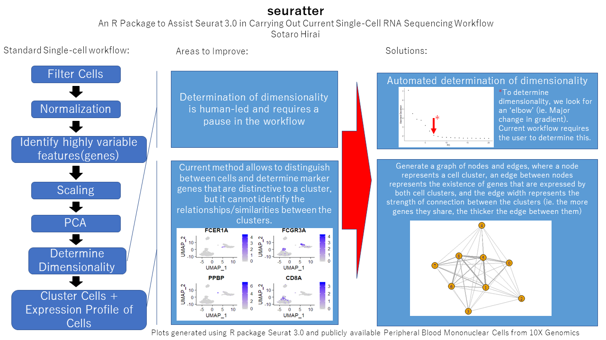

# seuratter

<!-- badges: start -->
<!-- badges: end -->

## Description

The goal of seuratter is to assist the Single Cell RNA Sequencing workflow carried out by Seurat and
to provide a different perspective to the data analysis component through generation of a graph. The current workflow provides information on each cluster but lacks the information that portrays the relationship between those clusters, in the context of gene expression. Therefore, seuratter attempts to solve this by plotting a network graph between the clusters to determine how related each pair of clusters are by examining similarity in gene expression profile.

## Installation

You can install the released version of seuratter like:

``` r
require("devtools")
install_github("sotaro0214/seuratter")
library("seuratter")
```

To run the shiny app:
``` r
run_shiny_seuratter()
```

## Overview

An overview of the package is illustrated in the image below. 
The package consists of two main features:
- Determining dimensionality for downstream clustering
- Generating graph that depicts relationships between clusters

Check the vignette for more information.

browseVignettes("seuratter")



Package structure:
- seuratter
  |- LICENSE
  |- README
  |- data
    |- PBMC.rda
    |- elbow_plot_data.rda
    |- gene_comparison_matrix.rda
  |- inst
    |- extdata
      |- HIRAI_S_A1.png
    |- shiny-scripts
      |- app.R
  |- man
    |- compare_cluster_genes.Rd
    |- determine_dimensionality.Rd
    |- draw_cluster_gene_relations.Rd
    |- PBMC.Rd
    |- elbow_plot_data.Rd
    |- gene_comparison_matrix.Rd
  |- R
    |- data.R
    |- seuratter.R
    |- shiny_seuratter.R
  |- Vignettes
    |- seuratterVignettes.Rmds
  |- tests
    |- testthat
      |- test_seuratter.R
    |- testthat.R
  |- DESCRIPTION
  |- NAMESPACE
  |- seuratter.Rproj

## Example
To run seuratter, simply use the run_seuratter() function using a Seurat object generated by
Seurat. Running this should generate 3 outputs: plot determining dimensionality, network graph, barplot giving a 
numerical perspective to the network graph.
``` r
run_seuratter(PBMC) #PBMC is a preloaded example data in this package.
```

## Contributions

The author of this package is Sotaro Hirai. The function available within this package include:

``` r
library("seuratter")
lsf.str("package:seuratter")
```

- determine_dimensionality
- compare_cluster_genes
- draw_cluster_gene_relations
- plot_cluster_relations
- run_seuratter

The above 5 functions were developed by Sotaro. The contributions of Sotaro come from two aspects of this package.
The other contributions come from the packages Seurat, dplyr, and igraph, which Seurat and dplyr are used for carrying out the standard single cell rna seq workflow to generate relevant data and igraph is used for producing a graphical output in the end.
One of Sotaro's contributions comes from the function determine_dimensionality. The function determine_dimensionality takes as an input an elbow plot and determines a dimension based on user defined cutoff. The output plot will indicate which dimension clears the cutoff. 
The elbow method is usually carried out by humans to determine dimensionality and is quite arbitrary, so this function aims to automate this procedure so that this determination becomes less arbitrary.
Sotaro's other contribution comes from the latter 4 functions. These are used in combination with the igraph package to generate a graph from the data generated by Seurat. One analysis Seurat lacks is the aspect of determining how the clustered cells relate to cells from other clusters. compare_cluster_genes compares the genes expressed by a pair of clusters and stores those in a matrix. draw_cluster_gene_relations then uses the output to generate a graph that maps the relationships between clusters, based on the similarity in gene expression profiles. The more related they are, the more stronger the connections are represented (by heatmap coloring). Seurat allows multiple clusters to cluster into a larger single cluster by using UMAP, but seuratter's approach allows to portray how these clusters within a higher-level cluster relate to each other. Some of the clusters within one high-level cluster may be more related to each other than others, and determining this allows us to observe the data at the same level of abstractness as Seurat, but at a higher resolution/definition.
Finally run_seuratter() acts as a controller function to bring together all the functions for generating the second functionality (not determine_dimensionality), for the user to easily obtain the output in one line of code.


## References:

ahmohamed. (February 14 2015). How to scale edge colors in igraph?. *Stackoverflow*. Retrieved from: https://stackoverflow.com/questions/28366329/how-to-scale-edge-colors-in-igraph

Butler et al. (April 2 2018). Integrating single-cell transcriptomic data across different conditions,
technologies, and species. Natural Biotechnology, 36, 411-420. https://doi.org/10.1038/nbt.4096

Csárdi G and Nepusz T. (2006). The igraph software package for complex network research. Inter-
Journal Complex Systems, 1695.

mnel. (November 13 2012). Gradient legend in base. Stackoverflow. Retrieved from: https://stackoverflow.com/questions/13355176/gradient-legend-in-base

Scrucca L., Fop M., Murphy T. B. and Raftery A. E. (2016) mclust 5: clustering, classification and density estimation using Gaussian finite mixture models The R Journal 8/1, pp. 205-233 https://cran.r-project.org/web/packages/mclust/vignettes/mclust.html

Stuart et al. (June 6 2019). Comprehensive Integration of Single-Cell Data. Cell, 177 (7): P1888-
1902.E21. https://doi.org/10.1016/j.cell.2019.05.031
